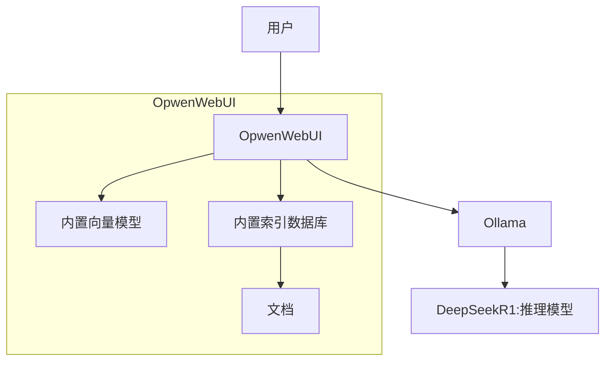

# 本地部署解决方案的一站式大数据人工智能应用

**功能亮点：**

1. **局域网离线对话**
   * 实现无需互联网依赖，支持多设备同时在线进行连续多轮对话。
   * 自动保存对话记录，便于后续查阅和分析。
2. **智能本地知识库**
   * 支持多种文档格式（PDF、文本、Word等）的上传与解析。
   * 高效处理文档内容，提供精准的专业回答，提升工作效率。
3. **灵活权限管理**
   * 采用权限组管理模式，确保不同用户访问不同的知识库。
   * 灵活配置权限，满足企业对数据安全和信息共享的需求。

**服务优势：**

1. **开箱即用的软硬件套装**
   * 包含经过优化的硬件设备和预先安装的软件系统。
   * 提供详细的快速安装指南和培训资料，降低使用门槛。
2. **专业部署支持**
   * 技术支持工程师提供现场或远程协助，确保顺利部署。
   * 一天内完成部署工作，快速投入使用。
3. **全面售后保障**
   * 一年在线技术支持服务，及时解决使用中遇到的问题。
   * 三年原厂硬件质保，确保设备长期稳定运行。

**适用场景：**

* **医院**\
  搭建医疗知识库，整合病历、医学文献、诊疗方案等信息，辅助医生快速查找医学资料、病历记录或用药指南，提升诊断和治疗的准确性和效率。同时支持权限管理，确保患者隐私和数据安全。
* **医保部门**\
  利用本地部署的优势，建立专属医疗费用知识库，整合报销政策、费用明细等信息，方便工作人员快速查询和处理医保相关事务。离线运行确保敏感数据不出医院网络，保障患者隐私和医保资金的安全。
* **保密研发部门**\
  为研发团队提供安全的知识管理解决方案，支持将机密技术文档、研发成果等存储于本地知识库中，通过权限管理控制不同级别的访问权限，确保核心知识产权不被泄露。离线运行模式保证数据不出局域网，避免因网络攻击或数据传输带来的安全隐患。
* **企业内部知识管理**\
  搭建专属的知识库，方便员工快速获取专业信息，提升工作效率。
* **法律事务所**\
  管理和查询大量法律文件，提供智能化的法律咨询支持。
* **设计工作室**\
  整合设计资料，提高项目管理和客户沟通效率。

**立即行动：**

如果你的企业或团队正在寻找一种安全可靠、高效智能的本地部署方案，请联系我！我们将为你提供专业的技术支持和服务，助您轻松实现大数据人工智能应用。

