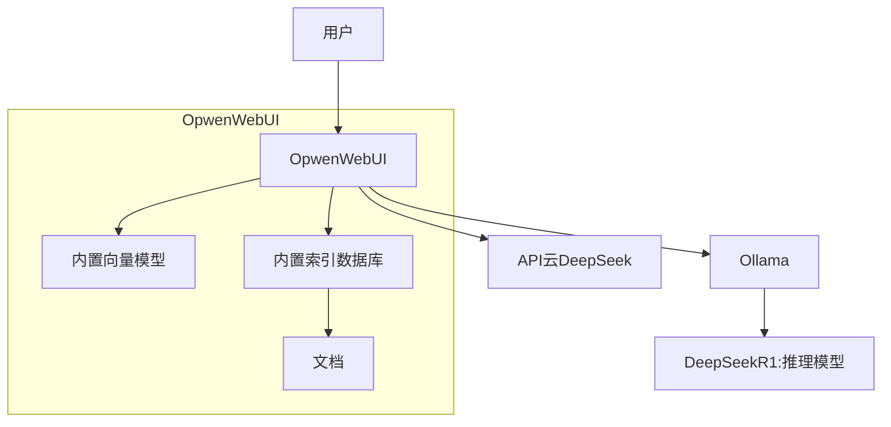

# 概述

## 目标

一个可以结合专有知识的大数据对话模型，回答问题结合联网和本地数据做出针对性的回答

```mermaid
 graph 
 A[用户] --> B[OpwenWebUI]
 subgraph OpwenWebUI
 B --> C[内置向量模型]
 B --> D[内置索引数据库]
 D--> E[文档]
 end
 B --> F[API云DeepSeek]
 B --> G[Ollama]
 G --> H[DeepSeekR1:推理模型]
 
```

第二个目标是调整向量模型从内置模型到Ollama

```mermaid
 graph 
 A[用户] --> B[OpwenWebUI]
 subgraph OpwenWebUI
 B --> C[内置向量模型]
 B --> D[内置索引数据库]
 D--> E[文档]
 end
 B --> F[API云DeepSeek]
 B --> G[Ollama]
 G --> H[DeepSeekR1:推理模型]
 
```

