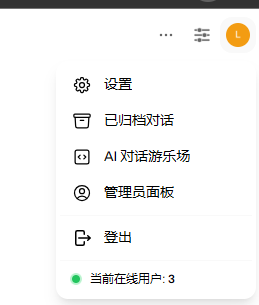

# 管理员手册

#### **1. 基本设置**

**1.1 设置修改初始密码**

* 登录后，请立即修改初始密码以确保账户安全！
* 点击右上角的用户头像，选择 **设置**（⚙️），进入个人设置页面。

<figure><figcaption></figcaption></figure>

* 在 **账号** 栏中,点击 **更改密码**后&#x7684;_&#x663E;示_，输入旧密码和新密码，点击 **更新密码** ️。

<figure><figcaption></figcaption></figure>

* 建议创建新的管理员账户，并删除预制的 `admin@admin.com` 账户。

**1.2 设置新用户注册**

* 进入 **设置统管理 > 系统设置** 页面（可通过导航栏中的 🛠️ 图标进入）。
* 在页面中找到 **允许新用户注册** 选项，开启后登录页会显示注册按钮 🔓。
* 配置 **默认用户角色**，建议选择 `待激活`，这样新用户需要管理员审核后才能使用（如果希望用户直接可用，可选择 `普通用户`）。

#### **2. 用户管理**

**2.1 新建用户**

* 进入 **系统管理 > 用户列表** 页面。
* 点击页面右上角的 **+号图标**（👥），进入新建用户界面。
* 填写用户信息（邮箱、用户名、密码等）并选择权限组，点击 **保存** ✔️。
* 支持批量导入用户：点击 **CSV文件导入**，上传格式为 `.csv` 的用户数据表格 📁。

**2.2 修改用户名称和密码**

* 在用户列表中找到目标用户，点击右侧的 **编辑图标**（✏️）。
* 修改用户名或密码，并调整权限组和其他配置。
* 点击 **保存** ✔️ 完成更新。

**2.3 查看用户的历史对话**

* 在用户列表中找到目标用户，点击右侧的 **对话图标**（💬）。
* 进入历史对话页面，可查看该用户的详细对话记录，并支持搜索和筛选 🔍。

**2.4 删除用户**

* 在用户列表中找到目标用户，点击右侧的 **删除图标**（❌）。
* 确认操作后，用户数据将被永久删除 ❌。

#### **3. 知识库**

**3.1 添加知识库**

* 进入 **工作空间 > 知识库列表** 页面。
* 点击右上角的 **+号图标**（📁），进入添加知识库界面。
* 填写知识库名称和描述，选择文档类型（支持 Markdown、PDF、Word、Excel 等格式） 📚。
* 上传文件或输入内容后，点击 **保存** ✔️。

**3.2 管理知识库权限**

* 在知识库列表中，找到目标知识库，点击右侧的 **设置图标**（⚙️）。
* 配置访问权限（公开、私有或特定用户组），并调整编辑和删除权限 🔒。

#### **4. 提示词**

**4.1 添加提示词**

* 进入 **系统管理 > 提示词设置** 页面（可通过导航栏中的 💡 图标进入）。
* 点击右上角的 **+号图标**（📝），输入提示词内容。
* 选择适用场景（全局或特定模型）并点击 **保存** ✔️。

**4.2 配置提示词规则**

* 在提示词列表中，找到目标提示词，点击右侧的 **编辑图标**（✏️）。
* 点击 **保存** ✔️ 完成配置。
